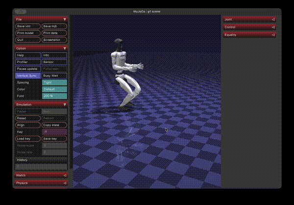

<div align="center">


**Developer-first action library for Unitree robots.**
<br>Making physical AI easier for EVERYONE

</div>

<p align="center">
  <a href="#quick-start">Quick Start</a>
  <span>&nbsp;&nbsp;&bull;&nbsp;&nbsp;</span>
  <a href="#action-library">Action Library</a>
  <span>&nbsp;&nbsp;&bull;&nbsp;&nbsp;</span>
  <a href="#cli">CLI</a>
  <span>&nbsp;&nbsp;&bull;&nbsp;&nbsp;</span>
  <a href="#deploy">Deploy</a>
  <span>&nbsp;&nbsp;&bull;&nbsp;&nbsp;</span>
  <a href="#examples">Examples</a>
</p>

<p align="center">
  
  
  
  
</p>

## What is Cadenza?

<div align="center">

</div>

Cadenza is a **developer-first action library** for Unitree quadruped (Go1) and humanoid (G1) robots. It provides 41 motor-level action primitives sourced from URDF specs — no RL training, no sim-to-real gap at the primitive level.

Write your robot program in Python, test it in MuJoCo simulation, then deploy to hardware with a single command.

---

## <a name="quick-start"></a> Quick Start

### Install

```bash
git clone https://github.com/aparekh02/cadenza.git
cd cadenza

python -m venv .venv
source .venv/bin/activate
pip install -e .
```

### First Simulation

```bash
mjpython example.py
```

Opens a MuJoCo viewer. The Go1 stands, walks 2m, arcs through a turn, jumps, and sits.

### Python API

```python
import cadenza

go1 = cadenza.go1()
go1.run([
    go1.stand(),
    go1.walk_forward(speed=1.5, distance_m=2.0),
    [go1.turn_left(), go1.walk_forward()],   # concurrent: walking arc
    go1.jump(speed=2.0, extension=1.2),
    go1.sit(),
])
```

---

## <a name="cli"></a> CLI

```bash
cadenza list go1                                     # list all Go1 actions
cadenza list g1                                      # list all G1 actions
cadenza sim go1 "walk forward then jump"             # simulate in MuJoCo
cadenza sim g1 "stand then walk forward"             # simulate G1
cadenza deploy go1 --ip 192.168.123.15               # deploy via SSH
cadenza deploy go1 --ip ... --mode direct            # deploy via DDS
cadenza deploy go1 --ip ... --mode bridge            # bridge mode
```

---

## <a name="action-library"></a> Action Library

41 motor-level action primitives for two robot platforms. Every action has exact joint targets, PD gains, and torque limits from URDF. No learned controller.

### Go1 Quadruped — 21 Actions

```python
import cadenza

go1 = cadenza.go1()
go1.run([
    go1.stand(),
    go1.walk_forward(speed=1.5, distance_m=3.0),
    [go1.turn_left(), go1.walk_forward()],   # concurrent: walking arc
    go1.jump(speed=2.0, extension=1.2),
    go1.sit(),
])
```

<details>
<summary><strong>Full Go1 action table</strong></summary>

| Action | Type | Description |
|--------|------|-------------|
| `stand()` | phase | Stand at default height |
| `stand_up()` | phase | Stand up from lying down |
| `sit()` | phase | Sit down |
| `lie_down()` | phase | Lie flat |
| `jump()` | phase | Jump in place |
| `walk_forward()` | gait | Walk forward |
| `walk_backward()` | gait | Walk backward |
| `trot_forward()` | gait | Trot (diagonal gait) |
| `crawl_forward()` | gait | Crawl (low, stable) |
| `pace_forward()` | gait | Pace (lateral gait) |
| `bound_forward()` | gait | Bound (synchronous front-back) |
| `turn_left()` | gait | Turn left in place |
| `turn_right()` | gait | Turn right in place |
| `climb_step()` | gait | Climb a step |
| `side_step_left()` | gait | Lateral step left |
| `side_step_right()` | gait | Lateral step right |
| `rear_up()` | phase | Rear up on hind legs |
| `shake_hand()` | phase | Extend front paw |
| `rear_kick()` | phase | Kick with rear legs |

All actions accept `speed` and `extension` multipliers. Gait actions also accept `distance_m` and `repeat`.

</details>

### G1 Humanoid — 20 Actions

```python
g1 = cadenza.g1()
g1.run([
    g1.stand(),
    g1.walk_forward(speed=0.3, distance_m=1.0),
    g1.crouch(),
    g1.lift_left_hand(),
    g1.stand(),
])
```

### Direct Library Access

```python
from cadenza.actions import get_library, list_actions

# List all actions
list_actions("go1")

# Get an action spec
lib = get_library("go1")
spec = lib.get("walk_forward")
print(spec.gait)        # GaitAction with velocity commands
print(spec.phases)      # list of ActionPhase (for phase-based actions)
```

---

## <a name="deploy"></a> Deploying to Hardware

Three deployment modes for real robots:

### SSH Deploy
Upload and run a script on the robot's onboard computer.

```bash
cadenza deploy go1 --ip 192.168.123.15 -c "walk forward then sit"
```

### DDS Direct
Send motor commands directly from your laptop over DDS (same network).

```bash
cadenza deploy go1 --ip 192.168.123.15 --mode direct -c "stand then walk forward"
```

### Bridge Mode
Run heavy computation on your laptop, lightweight actions on the robot.

```python
go1 = cadenza.go1()
bridge = go1.deploy_ssh_bridge(host="192.168.123.15", key="~/.ssh/go1_rsa")

while True:
    state = bridge.telemetry
    action = my_model(state)
    bridge.send_action(action, speed=0.5)

bridge.estop()
```

---

## <a name="examples"></a> Examples

| Example | Robot | Description |
|---------|-------|-------------|
| `example.py` | Go1 | Stand, walk, arc turn, jump, sit |
| `examples/unitree_go1/deploy_go1.py` | Go1 | Sim / SSH / DDS / bridge |
| `examples/unitree_g1/deploy_g1.py` | G1 | Humanoid sim and deployment |
| `tests/test_go1_actions.py` | Go1 | Action validation |

```bash
mjpython example.py
python examples/unitree_go1/deploy_go1.py sim
python examples/unitree_g1/deploy_g1.py sim
```

---

## Project Structure

```
cadenza/
  actions/            41 motor-level primitives (Go1 + G1)
  parser/             Natural language command parsing
  locomotion/         Kinematics, gait engine, robot specs
  deploy/             SSH, DDS, bridge deployment drivers
  robots/             Robot-specific primitive tables
  models/             MuJoCo XML models + meshes
  sim.py              MuJoCo simulator
  go1.py              Go1 developer controller
  g1.py               G1 developer controller
  __main__.py         CLI entry point

examples/             Deployment examples
tests/                Integration tests
```

---

## License

Apache 2.0 — see [LICENSE](LICENSE) for details.
